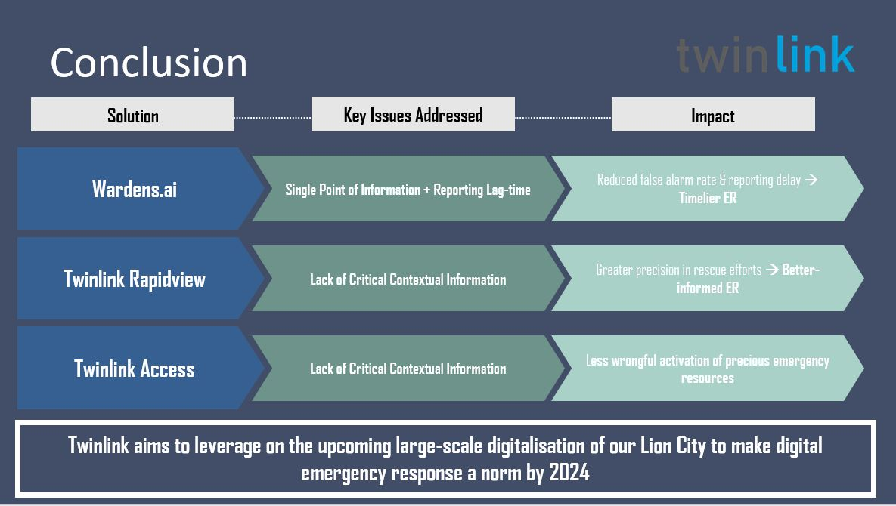

# Detailed Solution

1. [Situational Analysis](#Situational-Analysis)
1. [Strategy and Recommendations](#Strategy-and-Recommendations)
1. [Implementation](#Implementation)
1. [Conclusion](#Conclusion)

## Situational Analysis

### Situation

In 2019, fire in commercial premises accounted for 8.4% of the total incident count.
This is due to large areas & the premises being highly populated, thus difficulty in crowd control management during emergency. Occupants of commercial premises are less aware of evacuation plans, leading to higher chances of entrapment in the event of a fire.

Current fire-incident guideline for building fire safety managers:
1st stage alarm
Raised by -:
1. Break glass alarm system
2. Automatic heat/smoke detector system; or
3. Automatic sprinkler system.

Follow-up: Fire warden of fire floor will investigate the cause of alarm and provide sit-rep

2nd stage alarm
Commence evacuation upon confirmation of fire situation.

### Key Issues

**Single Point of Information** - Fire alarm systems are triggered with singular inputs from glass alarm, heat/smoke detector or sprinkler system. This leads to **High False Alarm Rate**.

**Reporting Lag-time** - Wardens or any public informants may not spot fire in time before the situation escalates. This leads to **Low Success Rate in Community Response**.

**Lack of Critical Context Information** - Fire safety personnel do not have access to critical information on the occupants in the danger zone to supplement rescue efforts. This leads to **High Fire Injury or Fatality Rate**.

## Strategy and Recommendations

**Twinlink**, an AI-enabled solution built on IBM infrastructure with **3 CORE FEATURES** to provide more timely and precise emergency responses

**Wardens.ai** - Using IBM Watson, we train digital wardens to provide instantaneous situation reports upon any inputs from local IoT sensors
**Twinlink Rapidview** - We pinpoint real-time positions of occupants on digital-twin building layout for responders
**Twinlink Access** - We provide key data for SCDF to analyze the severity of incidents and efficiently allocate EMS resources

### Justification
**Wardens.ai** monitors live CCTV footage and uses its neural network to positively identify fire before pushing situation reports to SCDF for appropriate emergency responses.

Wardens.ai also capture and store real-time information on occupants and fire on IBM Cloud Object Storage for further analysis in Twinlink Rapidview and Twinlink Access.

**Twinlink Rapidview** uses a WebGL-based 3D Visualization engine that retrieves stored geometries of the building from the cloud, and overlays critical information necessary for the emergency responders for an interactive access of a digital twin building. 

**Twinlink Access** provides an API Gateway to deliver critical data parameters for emergency services to optimise their resource allocation strategy

### Impacts
**Wardens.ai** - For every false alarm detected, it can mean a cost of S$664 saved - Reduced False Alarm Rate & Reporting Delay

**Twinlink Rapidview** - For every 3 minutes shaved, it can mean 1 more life saved - Greater Precision in Rescue Efforts

**Twinlink Access** - For every EMS team allocated efficiently, it can mean 1 more live saved - Greater Allocation Efficiency of EMS Resources

## Implementation

### Timeline

### Challenges and Mitigation

**Lack of Surveillance Coverage**

Some premises may have critical areas lacking in CCTV coverage, rending our Wardens.ai intervention ineffective. 
Digital Twin model can pinpoint these security gaps to authorities or the building management so they can step in to install the necessary surveillance. 

**Cybersecurity Threats**

The increase in connectivity and cross-sector collaboration leads to an increase in potential cybersecurity threats from both internal and external frontiers.

## Conclusion

